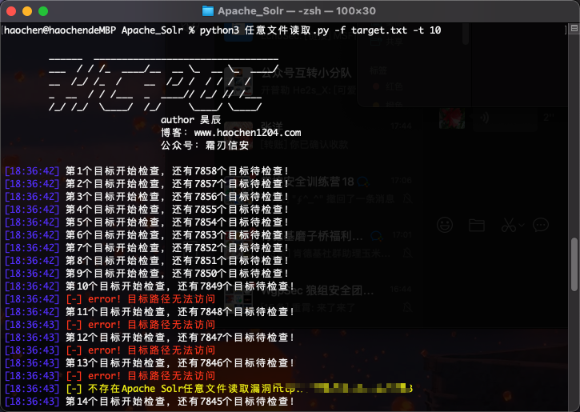
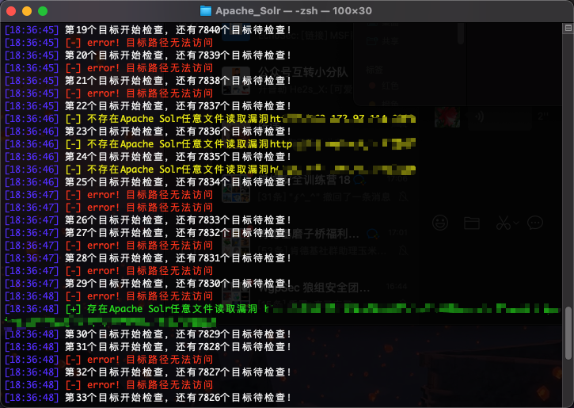

# 一个通用poc模版

相信大家在平时渗透的过程中，免不了要写一些poc，但是每回都从头开始编写，属实是很麻烦，所以这里就写了一个通用的模版分享给大家，功能还是比较齐全的。

主要功能有：

-h --help  打开帮助文档

-u --url 	测试单个url

-f --target_file 	从文件读取url进行批量测试

-r --result_file	 测试结果的输出文件的路径（默认为result.txt）

-t --thread_num	测试使用的线程数量（默认为50）

-p --proxies		是否开启代理（这个后面无需加参数）

首先，先看看我们的poc代码写在哪里

```python
def exploit(url):
    '''
        poc函数
        poc代码放在这里，这个函数的内容随便修改
        可以使用接口output_to_file将信息输出到文件中
        可以使用接口output将信息显示在命令行中（当print用就行）
            output需要2个参数，一个为显示的信息，一个为信息的类型（int 0 1 2 3）
                0 普通的信息
                1 攻击成功的信息
                2 攻击失败的信息
                3 出现错误的信息
    '''
    global proxies_judge
    proxies = {
    "http": 'http://127.0.0.1:8080',
    "https": 'http://127.0.0.1:8080'
    }
    head = {'User-Agent': 'Mozilla/5.0 (Windows NT 10.0; Win64; x64) AppleWebKit/537.36 (KHTML, like Gecko) Chrome/95.0.4638.69 Safari/537.36'}
    payload = "/xxx?=/etc/passwd"
    exp = url + payload
    try:
        if proxies_judge:
            re = requests.get(exp,verify=False,timeout=5,proxies=proxies)
        else:
            re = requests.get(exp,verify=False,timeout=5)
        if re.status_code == 200:
            msg = "存在任意文件读取漏洞 "+exp
            judge = 1
            output_to_file(msg)
        else:
            msg = '不存在任意文件读取漏洞'+url
            judge = 2
    except:
        msg = 'error! 目标路径无法访问'
        judge = 3
    output(msg,judge)
```

这个函数，就是我们poc编写的地方，大家可以随意发挥，这里有2个注意的点，一个是我设置了2个接口，一个用来向文件输出，也就是output_to_file，一个是代替print的output，至于为什么替代我们后面再说。先看output_to_file，这个只需要一个参数，就是我们要往文件中加的信息，我只把成功的信息加进去了，所以是放在了if re.status_code ==200这个判断下，而output则需要2个参数，一个是输出的信息，一个是输出信息的类型，因为在这个poc中，成功失败或者是错误，都是有着不同的颜色来方便区分的，所以要根据判断是否成功来传入judge，1位成功，2为失败，3为错误。

还有一个就是proxies，这个变量是用来连接我们的burp代理的，这里的设置要和我们的burp一样，这样我们就可以在测试poc的时候通过抓包来判断我们的poc所发送的包是否是正确的。而proxies_judge是用来判断是否要通过代理进行发包。

还有一个问题就是，我在编写多线程扫描时，在windows下经常会出现print混乱的问题，也就是本来应该换行的地方没有换行，不该换行的地方反而换行了，但是在mac下就没这个问题。针对这个问题，是因为print这个函数针对多线程是不安全的，也就是每个线程可以同时调用他，然后这些输出的内容本来应该是多个print输出的，就变成了一个print输出，这样就造成了输出混乱的情况。

针对这个问题，我通过死锁的方式进行了解决，让输出函数一次只能有一个线程调用，虽然会略微影响效率，但是比一堆乱七八糟的输出强。具体实现在这里。

```python
def output(msg,judge=0):
    '''
        输出到命令行
        在多线程的情况下，输出可能会混乱，这里加了个锁来保证输出结果的稳定，但会略微影响扫描效率
        如果不想要锁，追求极致的速率（mac下不加锁也不会乱，不晓得什么原因）
        请删除
            lock.acquire()
            try:
            finally:
            lock.release()
        4行代码
    '''
    lock.acquire()
    try:
        now_time = datetime.datetime.now().strftime('%H:%M:%S')
        now_time = Fore.LIGHTBLUE_EX + '['+now_time+'] ' + Fore.RESET 
        if judge == 0:
            print(now_time + msg )
        elif judge == 1: # 输出成功信息
            print(now_time + Fore.LIGHTGREEN_EX + '[+] ' + msg + Fore.RESET)
        elif judge == 2: # 输出失败信息
            print(now_time + Fore.LIGHTYELLOW_EX + '[-] ' + msg + Fore.RESET)
        elif judge == 3: # 输出错误信息
            print(now_time + Fore.LIGHTRED_EX +'[-] ' + msg + Fore.RESET)
    finally:
        lock.release()
```

好了，对于这个模版的讲解就先到这里，下面附上一些扫描的图片。






这个poc模版我已经放在github上了，欢迎大家下载使用，当然也可以在公众号回复poc来获取。

